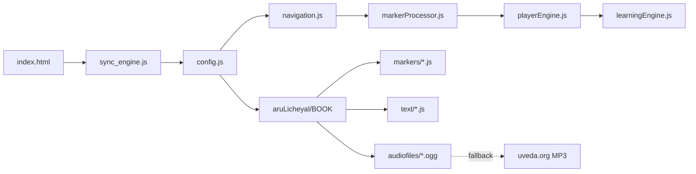

# Divya Prabandham Anusandhanam — Product Report

**Product name:** Divya Prabandham Anusandhanam (working short name: **Sandhai**)  
**Purpose:** Graduated *Sandhai* practice — memorization-style recitation of Tamil Sri Vaishnava Divya Prabandham with audio-synced text highlighting.  
**Stack:** Static vanilla JS (no framework, no build step).  
**Report date:** 11 July 2026  
**Branch state:** `adiyenSrinivasaDasan` tip matches `origin/main` (`2486c28`). Local uncommitted work adds deep links, smoke/content-status tooling, and docs on top of that tip.

---

## Executive summary

Sandhai is a focused learning tool: pick a prabandham and pasuram, choose a learning step (half-line → full verse), and practice with recitation audio while the active phrase is highlighted in sync.

**Strengths today**

- Core playback loop works across **19 books** in the UI picker
- Hand-verified phrase timing (where markers exist) drives tight RAM-mode sync
- Assets under **`aruLicheyal/<BOOK>/{markers,text,audiofiles}`** with factory-based `config.js`
- Shareable deep links (`?book=&pas=…`) + **Copy link**
- Smoke test, offline-manifest builder, and content-status report tooling

**Primary gap**

- **Content completeness**, not app architecture: many books have text and some audio, but only a subset have full `step1`–`step4` timing. Without markers, playback falls back to full-track streaming with no phrase-level highlighting.

**Critical path**

Marker authoring in `splitter.html` remains the bottleneck for expanding phrase-sync coverage (especially large books: PAT, TVM, PTM).

---

## Feature inventory

### Core learning

| Feature | Status | Notes |
|--------|--------|-------|
| 4-step graduated practice | ✅ | step1 half-line → step2 line → step3 two-line → step4 full verse |
| Prabandham + pasuram picker | ✅ | 19 books in UI; more folders/CONFIG entries exist on disk |
| Phrase-synced text highlighting | ✅ | When timing markers exist |
| Tamil / English text layers | ✅ | Loaded on demand via `getLanguagePath` |
| Repeat limit + auto-next | ✅ | Player controls |
| Playback speed | ✅ | 0.75×–1.25× |
| Dual audio pipeline | ✅ | RAM (Web Audio slices) vs native `<audio>` fallback |
| Deep links / Copy link | ✅ Local | `?book=&pas=&step=&lang=` (+ speed/repeat/autoNext); optional `play=1`; URL stays in sync |

### Platform / ops

| Feature | Status | Notes |
|--------|--------|-------|
| Local static server | ✅ | `scripts/server.py` (HTTP/1.1 ranges; `PORT` env) |
| Sync / cache-bust manifest | ✅ | `sync-check.json` via CI |
| GitHub Pages deploy | ✅ | `.github/workflows/static.yml` |
| Smoke test | ✅ Local | `scripts/smoke_test.py` + `smoke-test.yml` |
| Content status report | ✅ Local | `content-status.html` + `build_content_status.py` |
| Offline manifest builder | ✅ Local tooling | `build_offline_manifest.py` → `offline-manifest.json` (no PWA consumer yet) |

### Not shipped (still outstanding / held aside)

| Item | Notes |
|------|-------|
| PWA / service worker / theme / session restore | Prior large WIP was discarded; recoverable historically from stash `b5767260` (pre-`aruLicheyal`; needs port) |
| RN koyil meanings UI | Not wired in the player |
| `scrape_rn_koyil.py` | Held in local stash (`stash@{0}`) — not in working tree; do not commit for now |
| Splitter waveform / undo | In prior WIP / local experiments; not part of shipped player UX |

Deep links from that older WIP **were re-ported** onto the current player (without the rest of the PWA bundle).

---

## Content coverage (approx., July 2026)

Asset root: `aruLicheyal/` — **25** book folders on disk; **19** exposed in the player `<select>`.

Heuristic: marker files containing `"step1"` vs text/audio file counts (file presence ≠ full verse coverage). Prefer **`content-status.html`** for live, per-pasuram detail.

| Book | In UI | Markers w/ step1 (files) | Text files | Local `.ogg` | Notes |
|------|-------|--------------------------|------------|--------------|-------|
| TPL | ✅ | 1 | 2 | 2 | Good small-book baseline |
| PAT | ✅ | 4/5 chapter files | 6 | 43 | Strong audio; marker coverage still partial by chapter |
| TPV | ✅ | 1 | 2 | 4 | |
| NAT | ✅ | 1 | 2 | 15 | |
| PMT | ✅ | 1 | 2 | 11 | |
| TCV | ✅ | 1 | 1 | 3 | Thin local audio |
| TML | ✅ | 1 | 1 | 6 | |
| TPE | ✅ | 1 | 2 | 2 | |
| AAP | ✅ | 1 | 2 | 2 | |
| KCT | ✅ | 1 | 2 | 2 | |
| PTM | ✅ | 1 | 11 | 9 | Text strong; timing partial |
| TKT | ✅ | 1 | 2 | 3 | |
| TNT | ✅ | 1 | 2 | 4 | |
| 1TA | ✅ | 1 | 1 | 11 | |
| 2TA | ✅ | 0 | 1 | 11 | Audio present; timing thin |
| 3TA | ✅ | 0 | 1 | 7 | Timing thin |
| TVM | ✅ | 1/10 chapter files | 20 | 5 | Text broad; timing concentrated |
| RN | ✅ | 1 | 2 | 12 | |
| URM | ✅ | 1 | 2 | 9 | |
| 4TA / TVT / TVS / PTA / TVK | ❌ UI | mostly text stubs | varies | little/no audio | In CONFIG/disk, not picker |
| YRV | ❌ | empty folder | — | — | Placeholder on disk |

`offline-manifest.json` (generated): **25** books, **16** marked `fullyLocal`, **9** partial/remote-heavy.

---

## Architecture (current)



- **Config factories** resolve paths under `aruLicheyal/`.
- **On-demand `<script>` injection** loads timelines + language layers.
- **RAM pipeline** when markers exist; otherwise native stream.
- **Deep links** applied from the query string on load; `history.replaceState` keeps the URL aligned with the current selection.

Authoring: `splitter.html` → paste into `aruLicheyal/<BOOK>/markers/…`.

---

## Gaps and priorities

### P0 — Content

| Work | Why |
|------|-----|
| Continue PAT / TVM / PTM timing | Highest learner impact for large works |
| Fill thin-timing books (2TA, 3TA, …) | Audio already local for several |

### P1 — Product / UX (not shipped)

| Work | Why |
|------|-----|
| Session preference restore | Resume last book/pasuram across visits (deep links already cover shareability) |
| Wire RN koyil meanings UI | Needs scraper data + player UI (scraper currently stashed) |
| Splitter waveform / undo | Speeds marker authoring |

### P2 — Distribution

| Work | Why |
|------|-----|
| Optional PWA shell using `offline-manifest.json` | Offline practice; manifest builder already exists |
| Expose remaining CONFIG books in UI when ready | 4TA, TV*, PTA, etc. |
| Commit / CI-promote local tooling | Smoke test, content-status, deep links still uncommitted on this branch |

---

## Tooling reference

```bash
python3 scripts/server.py                 # http://localhost:8000
python3 scripts/smoke_test.py             # CI + local health check
python3 scripts/build_offline_manifest.py # regenerate offline-manifest.json
python3 scripts/build_content_status.py   # regenerate content-status.json
# open http://localhost:8000/content-status.html
```

See `CLAUDE.md` for architecture detail and marker-authoring conventions.

---

## Scorecard (current local branch)

| Area | Grade | Comment |
|------|-------|---------|
| Core learning loop | A− | Solid where markers exist |
| Content completeness | C+ | Uneven timing coverage |
| Config / asset layout | A | `aruLicheyal` + factories |
| Authoring UX (splitter) | B | Usable; waveform/undo not shipped |
| Tooling / CI | B+ | Smoke + content-status + sync + Pages (partly uncommitted) |
| Offline / PWA | D | Manifest tooling only; no SW/UI |
| Share / deep links | B+ | Shipped locally: query params + Copy link; no session restore yet |

---

*Report cleaned up 11 July 2026: deep links documented as present; discarded-WIP section no longer claims deep links are missing; RN koyil scraper noted as stashed.*
